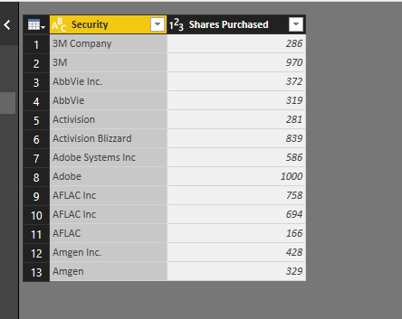
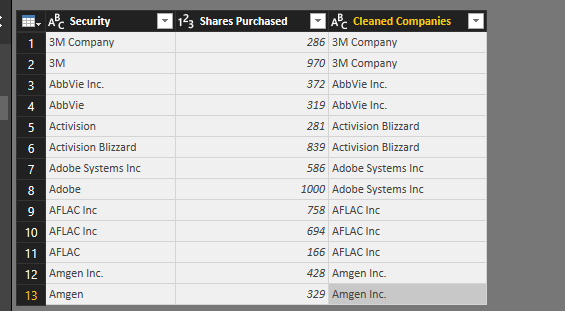

# Power-BI-and-Python
Python support was just added for Power BI. [Source](https://powerbi.microsoft.com/en-us/blog/power-bi-desktop-august-2018-feature-summary/#python)

Here are two *brief* tutorials / examples. 

Examples intended for people familiar with Power BI and Python. New to Power BI and Python? Check out some of my other [tutorials](https://github.com/click-here/Pandas-vs-Power-Query)

# Get Data

##### Description: We can calculate the lexical-diversity of some of the texts provided with [nltk](https://www.nltk.org/).


1. Paste the main.py code in the Python script textbox. 

   
   
2. Expand the table, close and apply.

3. Throw it onto a stacked bar chart!

	
   

# Process Existing Data
##### Description: Using the [fuzzywuzzy](https://github.com/seatgeek/fuzzywuzzy) module we can fix mispelled words given a known list.

1. We start with our csv file already loaded. (Notice how lines: 2, 4, 5, 8, 11, and 13 are incorrect derivatives of S&P 500 companies.)

	

2. As with the above tutorial you will definitely want to develop your script in your IDE of choice first. Two things to remember, you don't need to import pandas and you load the current dataset to a dataframe by using `df = pandas.DataFrame(dataset)`
Note: Relative file references will not work as expected.

What you actually need to paste into the 'Run Python script' box is shown below:

```python
from fuzzywuzzy import process

dirtydata_df = pandas.DataFrame(dataset)

knownlist_df = pandas.read_csv('https://raw.githubusercontent.com/click-here/Power-BI-and-Python/master/KnownList.csv',encoding='ISO-8859-1')

known_companies = list(knownlist_df['Security'])


def get_cleaned_company(company):
    return process.extractOne(company, known_companies)[0]

dirtydata_df['Cleaned Companies'] = dirtydata_df['Security'].map(lambda a: get_cleaned_company(a))
```

3. Viola! Your cleaned data!

	

