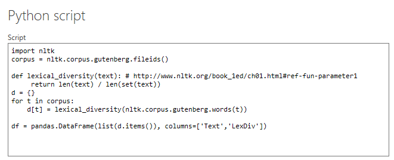
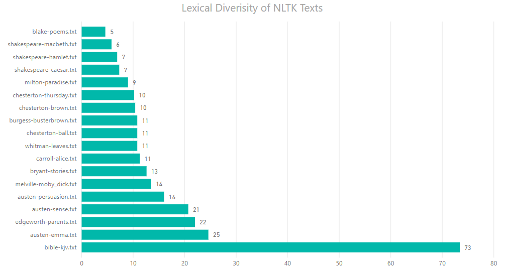

# Power-BI-and-Python
Python support was just added for Power BI. Here's a *brief* tutorial / example. [Source](https://powerbi.microsoft.com/en-us/blog/power-bi-desktop-august-2018-feature-summary/#python)

# Get Data Usage

With Power Query [ready](https://www.excelcampus.com/install-power-query/) we begin by loading the college scorecard data dictionary.

1. Paste the main.py code in the Python script textbox. 

   
   
2. Expand the table, close and apply.

3. Throw it onto a stacked bar chart!

	
   
 
Examples intended for people familiar with Power BI and Python. New to Power BI and Python? Check out some of my other [tutorials](https://github.com/click-here/Pandas-vs-Power-Query)